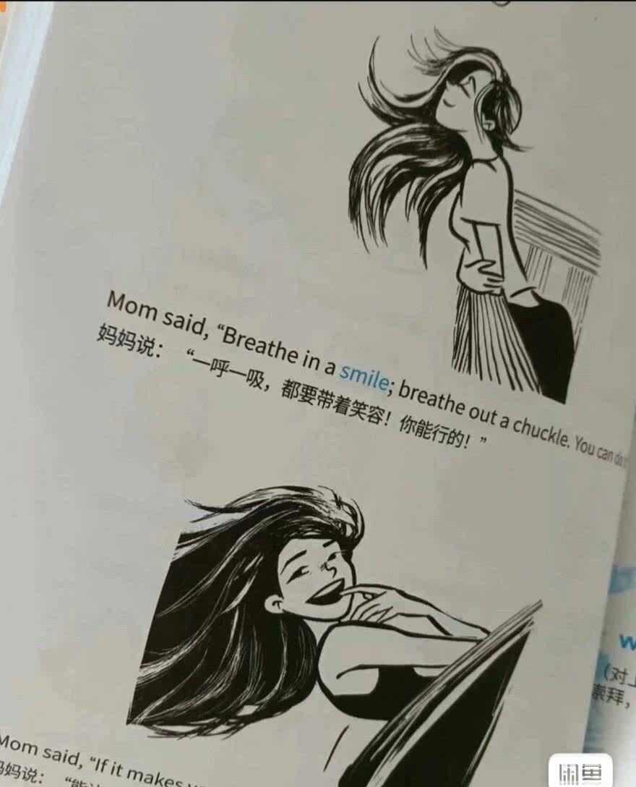

# Why didn't I see such an English vocabulary book sooner?

## Body

Why didn't I see such an English vocabulary book earlier?
Why didn't I see such an English vocabulary book earlier?
Why didn't I see such an English vocabulary book earlier?
Why didn't I see such an English vocabulary book earlier?
Why didn't I see such an English vocabulary book earlier?

[Fire][Fire][Fire] Electronic version! Electronic version! Electronic version!

Electronic products, sold without returns or exchanges!

[Fire] In the past, when memorizing words, we would do it one by one, facing rows of dull letters, forgetting what we just learned. Who understands this?

[Nail] The author is a foreign enterprise executive who won an international design award. After discovering that children had difficulty memorizing words, she decided to use her design talent to present details in life through comics. As a result, not only were the children quickly accepted, but they also easily mastered 3000 English words!

[Fire] The "Scene Recall Method" + "Comic Recall" in this book is incredibly efficient for memorizing words. The 1000+ hand-drawn illustrations in the book are full of creativity and impact. The author also groups together words from the same scene, allowing you to quickly remember a group of words while learning one word, making it unforgettable.

[Fire] Ten themes and over 3000 high-frequency words cover practical topics such as life, transportation, social interactions, entertainment, and dining. Each theme is followed by review questions and listening tests, helping reinforce the learned words, making them more firmly remembered!

[Fire] Most importantly, the book also includes some "confusing words" grouped together with pictures to explain their differences. Many groups are words I couldn't remember before, the author really put in a lot of effort!

[Nail] Whether you are a primary school student, middle school student, university student, or adult, this book is definitely the best choice. After completing the book, your vocabulary will significantly improve, and your daily life will greatly benefit from improved common spoken expressions, no longer struggling to say words when pointing at something.

[Bulb] It's a high-definition PDF version! Supports studying anytime and anywhere! Permanent edition!

Includes audio

No trial view available.

Just click on it if you like it!

## Images

## Payment

Here is a pay link on Stripe ( https://buy.stripe.com/3cs8yP7sY87d0vu9AB ). Please contact me lonlonago@foxmail.com after funding $89, and I will send you a complete data files , thank you!

